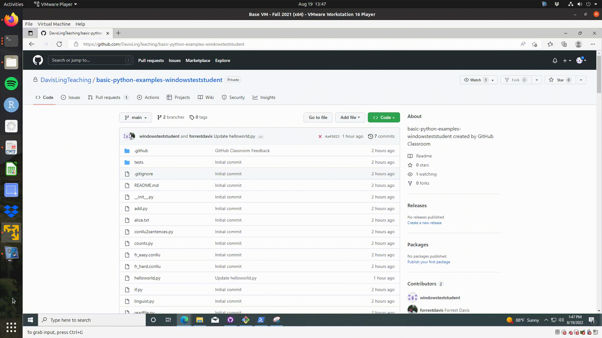
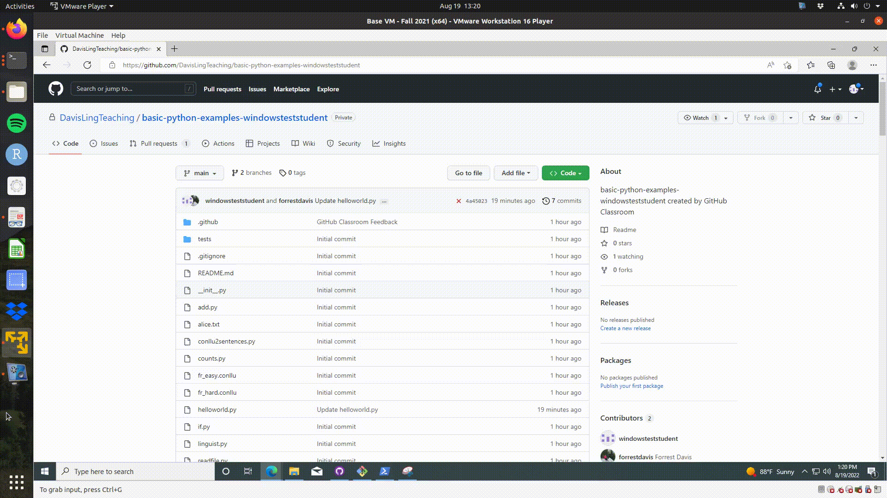

# Basic Python


The following introduces you to using python via some concrete exercises. Additionally, 
you are introduced to using Github for submitting assignments. At the conclusion of this 
assignment you should have some familiarity with key aspects of python and know how to submit 
your code for automatic grading.
If you'd like to complete the assignment using colab, a script called colab.ipynb 
has been included in the repo. Refer to the SettingUp repo for how to associate 
your github account and GoogleDrive. 

## Outline

- [ ] Readings for New Programmers
- [ ] Using Github to submit assignments
- [ ] Exercises
    - [ ] hello world (helloworld.py)
    - [ ] addition function (add.py)
    - [ ] if statements (IF.py)
    - [ ] for loops (loops.py)
    - [ ] open plain txt and print (readfile.py)
    - [ ] counts of word in plain txt (counts.py)
    - [ ] more advanced file manipulation (conllu2sentences.py)
    - [ ] basic class structure (basicClass.py)

## Readings for New Programmers

You may find it helpful to read through the book "Python for Linguists" by Michael Hammond. It is available via MIT's library [here](https://mit.primo.exlibrisgroup.com/discovery/fulldisplay?context=L&docid=alma9935181867206761&lang=en&search_scope=all&tab=all&vid=01MIT_INST:MIT). If you are having trouble accessing it, please email me at forrestd@mit.edu.
While the book uses some dated aspects of python, it is nonetheless a very helpful guide. I recommend you read through (and code along with) Chapters 1--5 if this is your first time using python. 

Additionally, I've heard [datacamp](https://www.datacamp.com/courses/intro-to-python-for-data-science) is useful. If you've never used the command line before, I strongly recommend 
"[The Missing Semester of Your CS Education](https://missing.csail.mit.edu/)" by our colleagues downstairs.

Ultimately, this class is meant to introduce you to and give you a feel for the major neural models being used in natural language processing as it relates to linguistics. As such, the coding will be instructional and structured in such a way as to facilitate you learning the core parts of models (rather than having to learn everything about python).
The class is around facilitating conversations about how to use and interpret the relevant models, not necessarily how to develop code that scales to billions of parameters, which is, after all, engineering. If you find yourself making no progress on an assignment in the course, you should
come to office hours, email me, or better yet use Github Classroom to point to the specific area of your code you 
are having trouble with. 

## Checking your work via Github Classroom

In this course, we will try to use Github Classroom. Not only will this interface introduce you to using Github, where you will find 99\% of code used in academic papers, but it also allows you to submit your assignments and have them automatically checked. This way, you can make progress on the assignment at your own pace, submitting as often as you'd like. Moreover, if you are stuck on a part of your code and would like me to take a look and try to help you (which I strongly encourage you to do!), you can do so directly through Github. Using their interface, I can comment on specific lines of your code, suggest changes, and we can have a discussion about what you are working on. This is my first time using Github in this capacity for a course, so I'm sure we will have to iron out any issues as we go together, but my hope is that it provides you direct and helpful feedback. 

In having accepted this assignment, a "pull request" will have been made. If you navigate there, 
you will see the initial autograding results. Clone the repo to your device and make changes 
to solve the exercises below. 

For example, we might change the code in helloworld.py to: 

```python
def helloWorld() -> str:
    """
    Returns a string
    Correct behavior: return the string "Hello World!"
    """

    return "hello"

```

Git will register that we have changed the file. To check this navigate to the directory 
and type 

```
git status
```

If you are using the command line, you should see something like: 


```
On branch main
Your branch is up to date with 'origin/main'.

Changes not staged for commit:
  (use "git add <file>..." to update what will be committed)
  (use "git restore <file>..." to discard changes in working directory)
        modified:   helloworld.py

no changes added to commit (use "git add" and/or "git commit -a")
```

Next we want to add our changes to our repo. We do this by, 

```
git add helloword.py
```

Then we add a message, which describes what we've done. For example, 

```
git commit -m "Trying out returning a string"
```

Now, we can "push" these changes to our repo by

```
git push 
```

Once it is done, you'll notice your repo online has changed and grading should commence again.

If you are using github desktop, the change will be automatically registered. You can add a
message via their API and push the changes. 

In time you should receive an email which records the results of the auotgrading. In 
this case it will say "All jobs have failed". If you "view workflow run" you can see 
the specific errors. Below is a short video showing you how to navigate to the autograder 
results from your repo on Github.




If you'd like to ask a specific question about your code to me, you can do so via 
the "feedback" branch which is automatically created. See the following, with walks through 
adding a comment to a specific line of your code. Once you submit a review, I get a notification,
and can supply additional comments or even suggest code.



## Exercises

### Hello World

We begin where everyone begins, returning or printing the string "Hello World!". 
With this, and all other exercises, we make use of methods (or functions). For a more thorough walk through of the key components involved here, see Chapters 2 and 5 of "Python for Linguists". In python one defines a method simply: 

```python
def FunctionName(var1, var2, ...):
    #Here goes some code....
    return 
```

Above you see a template of sorts for defining a python function. We turn to each component. First you see "def". This part is required and tells python that a function is being created. Next up is the name, here "FunctionName". This you can set to what you want though it helps if its informative. After the name, you see parentheses and some number of variables. All functions require parentheses, but they don't necessarily require variables to be passed in. We could have no variables, which would look like: 

```python
def FunctionName():
    #Here goes some code...
    return
```  

We turn now to the body of the function, where the actual coding happens. 
Two things tell python that we are beginning the body. The first is the semicolon after the parentheses. The second is the use of white space for the text under the function. The white space should either be 4 spaces (as above) or a tab. Whichever you use, be consistent! Python gets mad when you aren't. 
In our running example, notice we have a '#' before the text. Unlike, or perhaps just like, twitter, anything following after and on the same line of the '#' will be ignored. It's just there to annotate the code for other humans to read. Finally, we see "return" which ends the function. We can return variables or other things (e.g., return 1, return 'cat').

For helloworld.py, if you open the file you will see that some scaffolding has been provided for you. Namely, 

```python
def helloWorld() -> str:
    """
    Returns a string
    Correct behavior: return the string "Hello World!"
    """

    return
```

You should notice some familiar things. We are defining a function called "helloWorld" with no variables (or arguments) which returns nothing at the moment. There are some new things. First, there is "-> str" after the parentheses but before the semicolon. This is a clue from me to you about what I am expecting the output, or input as we will see shortly, to be. Here I'm expecting this function to return a string (str). Finally, notice the use of triple quotes. This demarcates a docstring, or a summary of sorts about the function. (It can also be used to comment out a chunk of code.) The docstring can include information about the arguments (or variables passed into the function), the desired behavior, an example, and information about what the output should be. I include them with all the code to both help you know what to do and also to teach you best practices/what to look for when reading others code.  

You should modify this file so that helloWorld has the intended behavior. Once you have done this you can save the file. When you submit your code (see the top of this README for information on how to do this), your work will be automatically checked so you know if you've done it correctly. You can submit as many times as you want, whenever you want, and can even ask me to look at specific parts of your code if you have questions. We return to this later. 

### Addition 

Hopefully you were able to fix up the helloworld.py code. Let's now try a slightly more involved function which adds two variables. Opening add.py you will see: 

```python
def Add(a: Union[int,float], b: Union[int,float]) -> Union[int,float]:
    """
    Args: 
        a: A variable that is either an int or a float
        b: A variable that is either an int or a float

    Returns:
        The sum of a and b (of type int or float)
    """
    return

if __name__ == "__main__":
    a = 3.
    b = 4.

    Add(a, b)
```

Hopefully you are getting the hang of this a bit, and you notice that Add takes two arguments ('a' and 'b'). Again, I've added some annotations which tell you that these variables are expected to be either an integer (0, 1, 2, 3, ...) or a float (e.g., 1.5), as represented by the Union[int,float]. Integers are "whole" numbers and floats are, roughly, numbers with decimals. A whole number can be represented as a float by add a decimal (e.g., 1.). There are more nuances to this, but they aren't relevant for this class. For this function, we expect the output to be a float or an integer. If you'd like to check how floats and integers interact, open your python interpreter (entering "python" into the command line will do) try the following (which uses type, an in-built function which tells you the type of the object):

```python
>>> a = 0 #an int
>>> b = 1 #an int
>>> print(a+b, type(a, b))
>>>
>>> a = 0. #a float
>>> b = 1  #an int
>>> print(a+b, type(a, b))
>>>
>>> a = 0. #a float
>>> b = 1. #a float
>>> print(a+b, type(a, b))

``` 

For this excerise, add the two variables and return the result.  

Perhaps you've noticed the extra bit of code at the bottom of the file. This bit tells python that when you run the script, 

```
python add.py
```

it should run everything under the

``` python
if __name__ == "__main__":
```

In this case, we set the value of two variables: a is set to 3 and b is set to 4. We then pass these values through the function add, and we print (our output to the command line) whatever return yields. If you run it without changing the code, you should see None, for example.

### If statements

For a more thorough introduction to if statements see Chapter 3.2 of "Python for Linguists". 
Opening IF.py you should see: 

```python
def checkWordLength(word: str) -> bool:
    """
    Args: 
        word: A variable holding a string

    Returns:

        Bool: 
            True if the number of characters in the word is greater than 10 
            False otherwise

        For example, 

            checkWordLength('dog') -> False
            checkWordLength('Mississippi') -> True

    """
    pass

if __name__ == '__main__':

    print(checkWordLength('dog'))
    print(checkWordLength('Mississippi'))
```

Here you will implement a simple if statement that checks the length of the input string (the argument "word"). It may be useful to consulate the python documentation for information about the 
built in function [len](https://docs.python.org/3.9/library/functions.html?highlight=len#len). With the inclusion of "if \_\_name\_\_ == "\_\_main\_\_", we can run: 

```
python IF.py
```

### For loops

For a more thorough introduction to for loops see Chapter 3.4 of "Python for Linguists". 
Opening loops.py, you should see:

```python
def sentPosition(words: list) -> list[tuple]:
    """
    Args: 
        words: A list of words from a sentence

    Returns:
        A list of tuples of (position in list, word)

        For example, 

        sentPosition(['I', 'love', 'cats']) -> [(0, 'I'), (1, 'love'), (2, 'cats')]

    """
    return
```

The function sentPosition expects a list of strings and returns a list of tuples. Tuples 
are a datatype in python that is similar to a list but more rigid. Once a tuple has been 
created it cannot be changed (see Chapter 2.3.5 of "Python for Linguists"). The intention 
for this function is for you to use a for loop (though other ways of accomplishing this
are possible). In addition to a for loop, you might make use of some of the following 
aspects of python (copied from the python interpreter).

```python
>>> x = 1
>>> x += 1
>>> x
2
>>>
...
>>> l = [1, 2]
>>> l.append(3)
>>> l
[1, 2, 3]
>>>
```  

### Reading files

These final exercises combine parts of what we reviewed above, in addition to making use 
of further parts of python. The first step in almost all projects in computational linguistics 
is reading files and formatting the data contained in them. We will begin with 
opening a file, reading the file line by line, and printing the result to the command line.

When you open readfile.py, you should see:

```python
def readLines(fname: str):
    """
    Args: 
        fname: A variable holding the name of file to read

    Returns:
        Print the file by line (N.B. careful with new line characters!)
    """
    pass

if __name__ == "__main__":

    #####################
    # Don't change this #
    #####################
    import sys
    fname = sys.argv[1]

    readLines(fname)
```

The above code introduces two new things: i) "import" and ii) "sys.argv". Import is how one 
loads in code from a library or from other python code you've written in other files. Here, 
we are importing [sys](https://docs.python.org/3/library/sys.html) which is commonly used python libary available without any additional downloading. From this library we call its method 
"argv" by sys.argv. The argv method points to a list of command line arguments passed to python.
This is best demonstrated with an example. 

```
python readfile.py small_alice.txt
```

If we were to run the above code, within python sys.argv would be a list of 2 elements: 

```
['readfile.py', 'small_alice.txt']
```

When running readfile.py, the second element in the list ('small_alice.txt') will be housed 
in the variable fname. 
Recall, that for any list, L, square brackets can 
be used to pick out an element of the list. Therefore, L[0] -> first element, L[1] -> second element, 
L[N] -> N+1 element. 
Notice that python, and most other computer programming languages, 
uses a, perhaps, unintuitve indexing scheme. That is, we start "counting" from 0, not 1. 

Finally, turning to the method readLines(), what we want is a function that opens a file, 
with the name fname, and prints each line of the file. To open a file consulate, either 
Chapter 4.3 of "Python for Linguists" or Section 7.2 of python's [documentation](https://docs.python.org/3.9/tutorial/inputoutput.html#reading-and-writing-files). As an additional hint, 
consider the function [strip](https://docs.python.org/3.9/library/stdtypes.html?highlight=strip#str.strip).

### Counts of words

For this exercise we will build on readFile.py. Opening counts.py, you should see:

```python
def getCounts(fname: str) -> dict:
    """
    Args: 
        fname: A variable holding the name of file to read

    Returns:
        A dict mapping words (i.e. space delinated tokens by line) to its 
        frequency in a corpus. For example, 

        With a file containing:
            The cat ate the cat food.

        This should return:

            {'the': 2, 'cat': 2, 'ate': 1, 'food.': 1}

    Hints:

        For a nice introduction to python dictionaries see https://realpython.com/python-dicts/ 
        Make sure to remove new line characters. Keep punctuation.

    """
    pass


if __name__ == '__main__':

    fname = 'small_alice.txt'

    getCounts(fname)


``` 

For the function getCounts, we will take a file name (fname), read the corresponding file, 
and return the frequency of each word in the file. The by-word frequencies should be recorded
in a dictionary (see Chapter 2.3.6 of "Python for Linguists"). You may also want to consider 
the built-in function for strings [split](https://docs.python.org/3.9/library/stdtypes.html?highlight=split#str.split). I would recommend workshoping your code with 'small_alice.txt' before 
submitting your code for grading. The grader will use a much larger file.

### conllu2sentences

As a final introduction to text manipulation, conllu2sentences.py lays out a task of reading
in a file and changing the data in some way. Opening the file, you should see: 

```python
def conllu2sents(fname: str) -> list:
    """
    Args: 
        fname: A variable holding the name of file to read

    Returns:
        A list of sentences from the conllu file. For example, 

        With a conllu file containing, 

            # sent_id = weblog-blogspot.com_marketview_20050511222700_ENG_20050511_222700-0003
            1	Google	Google	PROPN	NNP	Number=Sing	6	nsubj	6:nsubj	_
            2	is	be	AUX	VBZ	Mood=Ind|Number=Sing|Person=3|Tense=Pres|VerbForm=Fin	6	cop	6:cop	_
            3	a	a	DET	DT	Definite=Ind|PronType=Art	6	det	6:det	_
            4	nice	nice	ADJ	JJ	Degree=Pos	6	amod	6:amod	_
            5	search	search	NOUN	NN	Number=Sing	6	compound	6:compound	_
            6	engine	engine	NOUN	NN	Number=Sing	0	root	0:root	SpaceAfter=No

            # sent_id = weblog-blogspot.com_marketview_20050511222700_ENG_20050511_222700-0006
            1	Is	be	AUX	VBZ	Mood=Ind|Number=Sing|Person=3|Tense=Pres|VerbForm=Fin	5	cop	5:cop	_
            2	that	that	PRON	DT	Number=Sing|PronType=Dem	5	nsubj	5:nsubj	_
            3	a	a	DET	DT	Definite=Ind|PronType=Art	5	det	5:det	_
            4	money	money	NOUN	NN	Number=Sing	5	compound	5:compound	_
            5	maker	maker	NOUN	NN	Number=Sing	0	root	0:root	SpaceAfter=No

        The function should return:
            ['Google is a nice search engine', 'Is that a money maker']

    Hints:

        Notice the new line between entries (which contain sentences). 
        Notice the use of # as marking comments.
        Notice that the column(s) you need to consider.

        In the hard cases, you will see punctuation. For example, 

            # sent_id = weblog-blogspot.com_marketview_20050511222700_ENG_20050511_222700-0006
            1	Is	be	AUX	VBZ	Mood=Ind|Number=Sing|Person=3|Tense=Pres|VerbForm=Fin	5	cop	5:cop	_
            2	that	that	PRON	DT	Number=Sing|PronType=Dem	5	nsubj	5:nsubj	_
            3	a	a	DET	DT	Definite=Ind|PronType=Art	5	det	5:det	_
            4	money	money	NOUN	NN	Number=Sing	5	compound	5:compound	_
            5	maker	maker	NOUN	NN	Number=Sing	0	root	0:root	SpaceAfter=No
            6	?	?	PUNCT	.	_	5	punct	5:punct	_

        You should return: 
            ['Is that a money maker?']
        Notice that there is no space between maker and ?. Is this marked in the columns somewhere?

    """
    pass

```

To assist you in understanding the goals of the function, example input/output pairs are given.
As per the typing hints in the function instantiation, conllu2sent, expects the name of a file 
and returns a list. The conllu in conllu2sent refers to a file format used for 
dependency parsing, 
among other things (see [here](https://universaldependencies.org/format.html)). It consists 
of tab separated columns, with each column corresponding to a type of linguistic annotation. 
For example, the second column holds the form of a word (as it appears in the sentence), 
and the third columns holds the lemma or stem of the word. For example, above you 
should see the pair "Is" and "be". Blank lines mark sentence boundaries, and lines 
beginning with # are comments (similarly, # are comments in python). Your task is to 
read in a conllu file and output a list containing each sentence in the file. To do this, 
you'll want to loop over the lines in the file, paying particular attention to the sentence 
boundaries and to specific columns in the file. There is one final thing to keep in mind. 
Namely, the sentence should maintain normal spacing. That is, punctuation should directly 
follow the relevant word. One of the hints in the file should help. 

My recommendation would be to approach this in two parts. The first, try to get the sentences 
from the file "fr\_easy.conllu". Once you can do that, move onto "fr\_hard.conllu" which has 
punctuation.

### Basic classes

The final exercise is meant to introduce you to python classes. Put roughly, a class is a way 
of creating a new object (or datatype) with shared methods and variables. So for example, we've
seen methods that apply to strings, like split and strip. That is, python has a class called 
str which has a set of methods, like split and strip, which apply to instances of the class. 
It can take some time to get used to classes, and object-oriented programming more generally. 
Consulate Chapter 9 of "Python for Linguists". To show you how to format a basic class, I've
provided an example of a class called Word below (and in basicClass.py)

```python
class Word:
    """
    A class word manipulating words.

    Attributes:
        vowels (set): (class attribute) A set of all vowels
        text (str): Text of the word 
    """

    #A variable shared by all instances of the class
    vowels = set(['a', 'e', 'i', 'o', 'u'])

    def __init__(self, text):
        #self identifies the instance of class and can be used
        #to reference the variables of a specific instance of 
        #a class. So for an instance W of Word, W.text will 
        #return the text of that W. Within the class methods
        #self.text can be used to pick out the text of the instance.
        self.text = text

    def whereAreTheVowels(self):
        """
        A function that returns the position of the vowels in the word.

        Returns:
            list: A list of the positions of the vowels in the word.

        """
        where = []
        #enumerate is a built in function which yields the 
        #index of the element in a list and also the element
        #E.g., enumerate([a, b, c]) -> [(0, a), (1, b), (2, c)]
        #A cavet is enumerate is a generator so its return type
        #isn't exactly a list. We ignore this for now.
        #Here we loop through each character in self.text
        for position, letter in enumerate(self.text):
            #Checks if the letter is contained in the set 
            #vowels, if so, we append the position to where
            if letter in Word.vowels:
                where.append(position)
        #retun this list
        return where
```

Like functions/methods, classes have a syntax which is needed to define them. For python, 
it follows the template, where class is followed by the name of the class. Above, we define 
a class called Word. Notice the use of indents after the class defintion. Everything 
indented under the class is a part of the class. So the class Word contains the function 
whereAreTheVowels. There are some special methods specific to classes. The \_\_init\_\_ method 
is one such method, and it serves as the class constructor. That is, when we make an instance 
of a class, \_\_init\_\_ is automatically called. Morever, the arguments, if there are any beyond
self (we return to self in a moment), in this function are required for instantiating the class.
In the case of Word, that means we need to pass in a variable filling the slot of text. 

I've mentioned instance, or instantiates, above. What this means for classes is, in some 
loose sense, a distinction between types and tokens. A class creates a type, which can have 
attributes and functions/methods. When I make a token from the class, this is an instance of the class. 
In the example of Word, the type is Word, which has text and whereAreTheVowels() as an attribute
and a function respectively. A specific instance of Word, might be the variable w. We create this
variable by passing in one argument.

```python
t = 'Fig'
w = Word(t)
```

That is, we create an instance of Word that has, as its text attribute "Fig". Notice that the 
variable name within the class can be different then the variable we pass into it. That is, 
t != text. However, python will bind the value of t to the variable name text within the
\_\_init\_\_ function. This leads us naturally into self. This is a special variable that 
denotes the instance of a class. Within a class, the first argument of any method must be 
self (or a different name, but self is by convention). You can think of self as a way of sharing
information across the methods of a class. If we didn't, for example, add the variable 
text to self via self.text, there would be know way of referring to text in the 
whereAreTheVowels method. Finally, in creating a class we can create methods which can 
be called by class instances. In the example of w, we can call the function 
whereAreTheVowels by

```python
w.whereAreTheVowels()
```

Notice that we don't pass any arguments in, despite self being in the function declaration. This
is because self is special and automatically assumed and passed into the function. 

For this exercise, follow the description provided at the bottom of basicClass.py and create 
a class called Linguist with two attributes, name and advisor, and a function addUniversity, 
which takes one argument and adds it to the class instance (via self.).   
