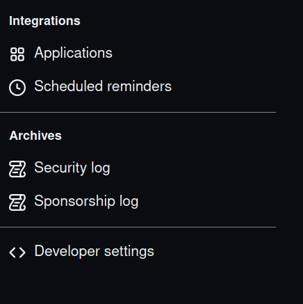

# Using colab and how to interact with Github

In case you'd rather do the assignments entirely online (maybe you like being 
online all the time, maybe you couldn't get the packages to download on your computer, 
maybe your laptop isn't working), the following guide will 
walk you through how to do this via colab. Colab is a service provided by 
Google which gives you access to python with free compute resources (like a GPU!). Colab 
can interact with your GoogleDrive, allowing you to save and to load your own files. You 
can even clone repositories from Github. We will use these two facts to work on 
and submit assignments all via the cloud. 

## Prerequisites 

- [ ] Google account with access to GoogleDrive
- [ ] Github account (see [Github.md](Github.md)) 
- [ ] Wifi

## Adding Colab to your GoogleDrive

If you haven't used colab on your GoogleDrive before you'll need to add it 
to the apps. To do this, within GoogleDrive, right click. You'll see a bunch 
of options for new things you can create. Click "More". If you don't see 
Google Colaboratory click '+ Connect more apps'. Search colaboratory and install
the app. You will now be able to create and use colab notebooks. 

## Basic of Colab

Google has a guide for using Colab which you may find useful ([link](https://colab.research.google.com/?utm_source=scs-index)). Essentially, Colab is a way of writing and 
executing Python code directly in your browser. A Colab notebook consists of 
two blocks. 

The first is a text block, where you can annotate your code. It 
use Markdown, which is what this itself is written in. Markdown is a basic markup 
language which let's you write formatted files using plain text files. It's pretty
simple (especially compared to LaTeX). You don't have to dig into it, if you don't 
want to. The text blocks on Colab include shortcuts to most things you might 
be interested in.  

The second type of block is a code block. It is within these that you write 
python code, and you can even execute it. The entire notebook defines 
a workspace, so a function written in one code block can be accessed 
in another code block. (N.B. You may find it useful to update the number 
of spaces for indentation to 4. You can do this via the settings, which 
are accessible within any colab script. Navigate to "Editor" and use 
the dropdown menu under "Indentation width in spaces".)

## Allowing Colab to Access Colab scripts on Github

We are using private github repos for this course. You will need to allow 
colab access to such repos. To do this: 

1. Click this [link](https://colab.research.google.com/github/). 
2. Click the checkbox "Include Private Repos"
3. Sign-in to your Github account and authorize Colab via the popup window
4. The link in Step 1 should allow you to browse your repos. Click a repo 
   to access it.

Access a repo via step 4 will allow you to access a copy of your repo. However, 
as far as I can tell, this will only give you access to any existing colab 
scripts on the repo. We can go one step further than this. 

## Generating a GitHub access token

To download and edit all the files in your github repository, we need to interact 
directly with github. First, we need to create a personal access token. To do this, 
got to your github. Navigate to the Settings: 


Then navigate to "Developer Settings":



Once there, navigate to "Personal access tokens". Then click "Generate new token". 
Write the token down somewhere (it will be long and basically a string of random 
stuff). You won't be able to see it once you set it up, so don't lose what you wrote
down (you could always create a new token if you mess this up). Also crucially, 
DO NOT SHARE THIS TOKEN. Don't add it to a file that you push onto github, for example.

## Cloining repo to GoogleDrive

With our token in hand, we can now clone our private repos to github. I've included 
a template colab script to do this ([CloningGitRepo.ipynb](CloningGitRepo.ipynb)). 
Once again, if you edit this to add your 
token, please do not push the changes to github. Below, I go over the components 
of this script. 

To clone the repo, first we "mount" GoogleDrive to our colab instance. That is, 
we make sure we can access our GoogleDrive via colab by typing the following in 
a code block. 

```
from google.colab import drive
drive.mount("/content/drive")
```

This will prompt you to allow colab to access your GoogleDrive. Do so. Next, 
we need to set some variables: 


```
#Should be the same for you
PATH = "/content/drive/MyDrive"

#Additional path to where you want to save your repos
REPOPARENT = "/PATH/TO/PARENT/"

#Name of repo
REPONAME = "BasicPython"

#Github account name 
GITNAME = 'YOUR GITHUB NAME'

#Git Personal Access Token DO NOT SHARE THIS!
GITTOKEN = "YOUR ACCESS TOKEN"
```
 
Now, we can navigate to where we want to save our repo (PATH+REPOPARENT) 
and clone the repo:

```
#Navigate to place to save repo
%cd "{PATH}{REPOPARENT}"

#Clone repo
!git clone "https://{GITTOKEN}@github.com/{GITNAME}/{REPONAME}.git"
```

We can check that this worked by first navigating to the repo:

```
%cd {REPONAME}
```

Then, we check that we have a clone:

```
!git status
```

And that's that! You can now edit files directly in colab by navigating 
to them using the interface on the far left and opening the file by double-clicking. 
For each assignment, I include a colab script for interacting with the files 
(assuming you have cloned the repo using the above steps). This will also 
include how to add changes. It is rather straightforward. You use the same 
commands we discussed in [Github.md](Github.md), but we prepend !.

If you've followed along with the prior guides, you should be familiar with 
the command line interface, you 
should have python on your computer, 
you should be able to run the python 
interpreter/scripts, you should 
have a github account, you should 
be familiar with submitting 
assignments via Github Classroom, 
and, finally, you should have the 
ability to use colab for your
assignments :)
