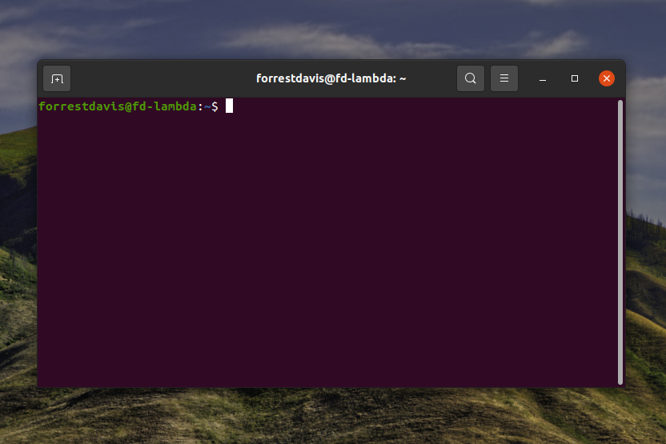

# Some basics in using the command line

If you haven't used the command line before, it can be a bit confusing. The following 
goes over some basic commands for navigating the command line. See [Python.md](Python.md)
for using python on the command line. I focus here on commands that will 
work with Linux or Mac. I confess that I haven't used Windows since I was a kid. I installed
a virtual machine with Windows to test some of the course materials, and it seems 
PowerShell accepts similar commands. Windows 10 allows you to install Linux in the same
environment as your OS, so I'd recommend doing that. For a more thorough introduction 
and overview of using the command line see "[The Missing Semester of Your CS Education](https://missing.csail.mit.edu)".

## Opening the command line

This is straightforward, just search Terminal (if you are on Windows see the note above). 
Starting terminal you should see a window like: 



## Navigation 

Now that you have the terminal open, let's figure out where you are. If you run 
pwd you will get the name of the directory (or folder) that you are in. 
Below, and in following code demonstrations, I show you the command and sample
output to give you a sense of what to expect. You should
follow along on your computer.   

```
forrestdavis@fd-lambda:~$ pwd
/home/forrestdavis
```

Typing ls will show you the files in the current directory.

```
forrestdavis@fd-lambda:~$ ls

 Dissertation.pdf       pictureOfMyCat.png     
 test.py                README.md

```

In all likelihood, directories (or folders) will be in one color and files in another. 

Suppose we had the following directory structure:


```
/home/forrestdavis
│   
│   Dissertation.pdf
│   pictureOfMyCat.png
│   README.md
│   test.py
│
└───folder1
│   │   file011.txt
│   │   helloWorld.py
│   │
│   └───subfolder1
│       │   file111.txt
│       │   file112.txt
│       │   ...
│   
└───folder2
    │   file021.txt
    │   file022.txt
```

In order to run helloWorld.py or edit file011.txt from the command line, it is useful 
to navigate to folder1. We can do that by entering cd folder1

```
forrestdavis@fd-lambda:~$ cd folder1
forrestdavis@fd-lambda:~/folder1$ ls

 file011.txt    helloWorld.py

```

We can also navigate backward using cd ..

```
forrestdavis@fd-lambda:~/folder1$ cd ..
forrestdavis@fd-lambda:~$ ls

 Dissertation.pdf       pictureOfMyCat.png     
 README.md              test.py                

```

If I wanted to edit file111.txt, I can move through multiple folders by adding 
to my cd statement (or successively typing cd) like cd folder1/subfolder1

```
forrestdavis@fd-lambda:~$ cd folder1/subfolder1
forrestdavis@fd-lambda:~/folder1/subfolder1$ ls

 file111.txt    file112.txt

```

I can similarly chain backward movements like cd ../..

```
forrestdavis@fd-lambda:~/folder1/subfolder1$ cd ../..
forrestdavis@fd-lambda:~$ ls

 Dissertation.pdf       pictureOfMyCat.png     
 README.md              test.py                
```

I could have, instead, just typed cd which would have returned me to my home directory. 
Finally, in addition to ls, it is also useful to see "hidden" files (especially when 
using Github). You can access these by typing ls -a 

```
forrestdavis@fd-lambda:~$ ls -a

 .                      ..
 .bashrc                Dissertation.pdf       
 pictureOfMyCat.png     README.md
 test.py                .vimrc

```

## Other useful commands
 
There are a number of handy programs that come along with your command line. I'll focus
on a very small fraction here. 

Let's imagine we have a file "hello.txt" which has two lines: "Hello!" and 
"Welcome to the course". We can interact with that file on the command line
in various ways. We can output all the lines of the file using cat
 
```
forrestdavis@fd-lambda:~$ cat hello.txt 
Hello!
Welcome to the course
```

I can add a line to the file using echo and >>

```
forrestdavis@fd-lambda:~$ echo "Noam Chomsky!" >> hello.txt
forrestdavis@fd-lambda:~$ cat hello.txt 
Hello!
Welcome to the course
Noam Chomsky!
```

If we had instead use only one > above, the file would have been overwritten and 
just the line "Noam Chomsky!" would remain. We can even chain together commands 
using "pipes", represented by |. I might have a large file which I want to see 
only the top part of. I can do this by chaining cat with another command 
called head using a pipe. It won't show a difference in our running example because 
the file is so small. 

```
forrestdavis@fd-lambda:~$ cat hello.txt | head
Hello!
Welcome to the course
Noam Chomsky!
```

The command tail does a similar thing with the bottom part of a file. You can 
also just run head or tail followed by the filename. With additional 
commands we can create useful programs. For example, we might count how many 
words there are in a file. 

```
forrestdavis@fd-lambda:~$ cat hello.txt | wc -w
7
```

We might add another "Noam Chomsky!" line and get the number of times each line occurs:

```
forrestdavis@fd-lambda:~$ echo "Noam Chomsky!" >> hello.txt | cat hello.txt | uniq -c
      1 Hello!
      1 Welcome to the course
      2 Noam Chomsky!
```

Finally, we can use the command grep to search for strings (using regular expressions, 
if you know how). 

```
forrestdavis@fd-lambda:~$ cat hello.txt | grep "the"
Welcome to the course
```

Notice that grep returns the line(s) with the search term. We can have it return 
lines without the search term by using the flag -v

```
forrestdavis@fd-lambda:~$ cat hello.txt | grep -v "the"
Hello!
Noam Chomsky!
Noam Chomsky!
```
