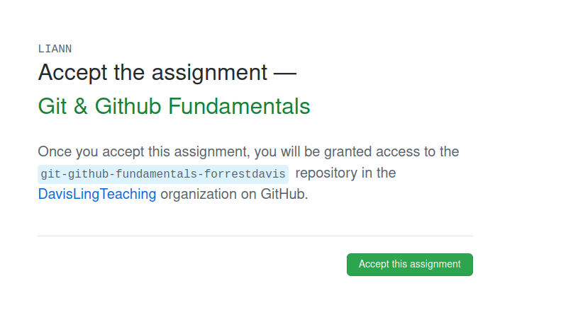
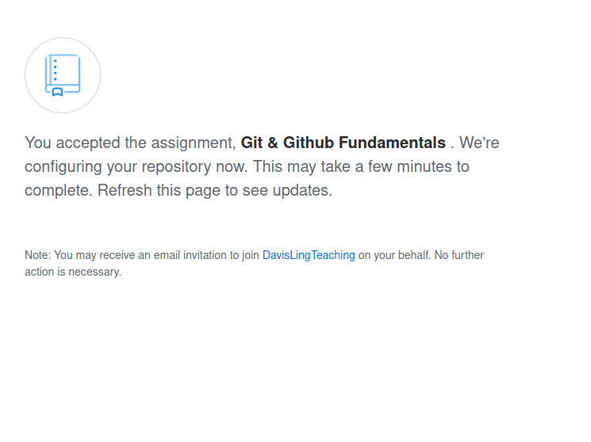
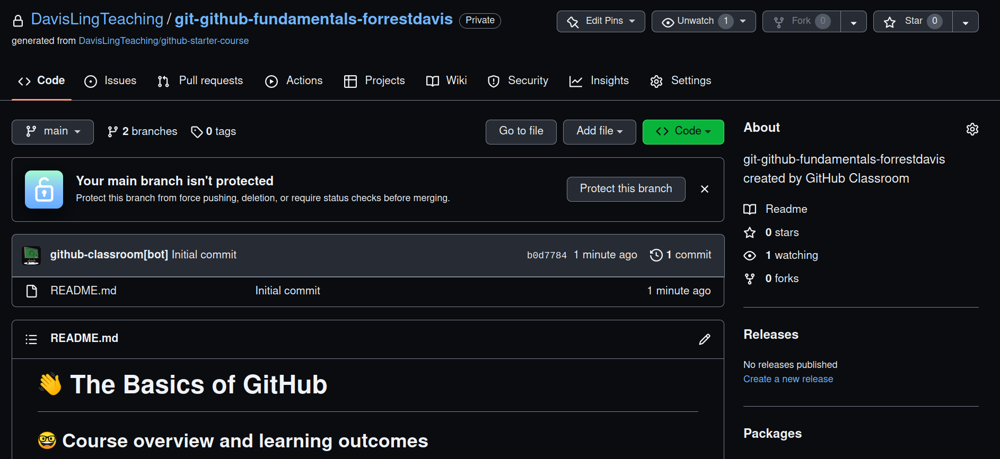

# Creating a Github account and using Github

## Creating an account

You should create a github account by navigating [here](https://github.com/). Use your MIT (or 
other university email) in signing up so that you can access the student [benefits](https://education.github.com/benefits). 

You can either download the Desktop version of github [here](https://desktop.github.com/) or
use the command line interface [here](https://git-scm.com/) (this is what I do, so I'm more familiar with this). 

If you are using the Desktop version, I believe you can skip to the bottom of this section (i.e.
to "Once you have github...").

For Windows, if you are using the command line interface, install it with Git Bash. 
Additionally, take care with the default text editor for git. It's default is vim. 

If you aren't familiar with vim, I recommend using Notepad for Windows, Text Editor in Ubuntu/Linux (which 
you can access via the terminal with the command gedit), and TextEdit for Mac OS.
Also note, when asked whether to let git decide or
to override the default repository name, use override and set to main. After that use the defaults for the prompts. Once you have installed it, enter the following commands: 

```
  git config --global user.name "NAME"
  git config --global user.emal "email@etc.com"
```

With NAME set to your github username and similarly for email.

An additional useful step is to add a new public key to your github, so that you can use github without having to sign in each time you try downloading code. To do that, first create a new 
ssh key, if you don't already have one, ([instructions](https://docs.github.com/en/authentication/connecting-to-github-with-ssh/generating-a-new-ssh-key-and-adding-it-to-the-ssh-agent)). [N.B. use your github email in creating the ssh key].  
Once you have done this, see this [guide](https://docs.github.com/en/authentication/connecting-to-github-with-ssh/adding-a-new-ssh-key-to-your-github-account). 

## Using Github

The main object of Github is a repository or a repo. A repo is a collection of code
which is stored on Github and can be downloaded easily be everyone. Within 
software development Github is a key resource for developing and maintaining 
open source projects. Within research, it's where most everyone stores the code 
associated with their paper. For this course we will use repos for assignments. 
In fact, we will use Github Classroom, which allows you to use Github's interface 
to submit assignments for automatic grading and in a way that I can easily provide
feedback.

First, let's begin with interacting with a given repository, before we talk about 
submitting and getting feedback on assignments. Assuming you have set up a 
github account successfully, navigate to the following [link](https://classroom.github.com/a/aFMlQpuS), 
which will add you to the course Github Classroom and provide a beginner guide to using github. You should see the following sequence of things in following the link: 

1. You'll land here after clicking the link. Click "Skip to the next step $\rightarrow$"
       


2. Next you'll be asked to accept the assignment. Do so.



3. Once you accept you should see this. Wait a moment and then refresh the page. 



4. Upon refreshing you should see the following. Click the link in the blue box. 


5. Finally, you should land on your repo. Note that this is a private repo. Only 
you and I can see it. 




If you are using command line, 
clone the code using ssh (navigate to the green "<> Code" button and use 
the ssh option). Then navigate to your desired 
location (via Git Bash on Windows or Terminal on Mac/Linux) and enter: 

```
git clone LINK
```

where LINK is from copying the ssh option in the online copy of the repository (on Github). 
This will copy the repo and it's contents to 
your computer. 

If, instead, you are using Github Desktop, you can clone the repo directly by selecting clone repository and selecting the name from the drop down menu.

You should now be all set to use github for the course. We will try out more of the workflow 
with another assignment. 

The typical workflow for using github involves the following steps (exemplified 
with the just created repo above)

1. Checking the status of your repo (i.e. what files have been changed) which is 
done via:

```
(LIANN) forrestdavis:~/Projects/git-github-fundamentals-forrestdavis$ git status
On branch main
Your branch is up to date with 'origin/main'.

nothing to commit, working tree clean

```

2. If there are updates, download these updates using git pull: 

```
(LIANN) forrestdavis:~/Projects/git-github-fundamentals-forrestdavis$ git pull
Already up to date.
```

3. Update your files to complete the assignment (not required for this particular 
example repo, but I demonstrate changes anyway). You can see your changes using git status.  

```
(LIANN) forrestdavis:~/Projects/git-github-fundamentals-forrestdavis$ git status
On branch main
Your branch is up to date with 'origin/main'.

Changes not staged for commit:
  (use "git add <file>..." to update what will be committed)
  (use "git restore <file>..." to discard changes in working directory)
	modified:   README.md

no changes added to commit (use "git add" and/or "git commit -a")
```

4. Add your changed files via git add. You can either do this by file via git add FILENAMe or you can add all "tracked files" (i.e. the ones associated with the repo online) via 
git add -u: 

```
(LIANN) forrestdavis:~/Projects/git-github-fundamentals-forrestdavis$ git add README.md
(LIANN) forrestdavis:~/Projects/git-github-fundamentals-forrestdavis$ git status
`On branch main
Your branch is up to date with 'origin/main'.

Changes to be committed:
  (use "git restore --staged <file>..." to unstage)
	modified:   README.md
```

5. Add a description of what changes you made via git commit -m MESSAGE: 

```
(LIANN) forrestdavis:~/Projects/git-github-fundamentals-forrestdavis$ git commit -m "Removed second line of README.md"
(LIANN) forrestdavis:~/Projects/git-github-fundamentals-forrestdavis$ git status
On branch main
Your branch is ahead of 'origin/main' by 1 commit.
  (use "git push" to publish your local commits)

nothing to commit, working tree clean
```

6. Notice that our status now says that our branch is ahead of the origin/main one. This
means the version on your computer has been changed from the version of the repo on
Github. You can update this version by "pushing" your changes. This is done via 
git push: 

```
(LIANN) forrestdavis:~/Projects/git-github-fundamentals-forrestdavis$ git push
Enumerating objects: 5, done.
Counting objects: 100% (5/5), done.
Delta compression using up to 4 threads
Compressing objects: 100% (2/2), done.
Writing objects: 100% (3/3), 291 bytes | 291.00 KiB/s, done.
Total 3 (delta 1), reused 0 (delta 0)
remote: Resolving deltas: 100% (1/1), completed with 1 local object.
To github.com:DavisLingTeaching/git-github-fundamentals-forrestdavis.git
   b0d7784..f18a28d  main -> main
(LIANN) forrestdavis:~/Projects/git-github-fundamentals-forrestdavis$ git staus
On branch main
Your branch is up to date with 'origin/main'.

nothing to commit, working tree clean
```

As you do this many times, you'll accumulate changes on your online repo. You can 
see a log of all your commit messages using "git log": 

```
(LIANN) forrestdavis:~/Projects/git-github-fundamentals-forrestdavis$ git log
Author: forrestdavis <fd252@cornell.edu>
Date:   Sat Aug 27 12:29:40 2022 -0400

    Removed second line of README.md

commit b0d77842f9c1de506e5d34b63a81f184525e3eac
Author: github-classroom[bot] <66690702+github-classroom[bot]@users.noreply.github.com>
Date:   Sat Aug 27 16:09:22 2022 +0000

    Initial commit
```

Issues may arise, especially around branch conflicts, which require other commands 
like merge. If you run into issues, please post in the Discussion portion of the 
canvas page, and I, or anyone else in the class who happens to know github, can 
provide guidance. 

## Submitting assignments and getting feedback

The above discussion hopefully showed you the basics of using github. What's left is
how to get grades and feedback from me on assignments. You may begin with the 
BasicPython assignment, which you can activate via this [link](https://classroom.github.com/a/gv24Yj56). The following recapitulates portions of the README of that assignment. 
It is repeated here to serve as a general reference point. 

In this course, we will try to use Github Classroom. Not only will this interface introduce you to using Github, where you will find 99\% of code used in academic papers, but it also allows you to submit your assignments and have them automatically checked. This way, you can make progress on the assignment at your own pace, submitting as often as you'd like. Moreover, if you are stuck on a part of your code and would like me to take a look and try to help you (which I strongly encourage you to do!), you can do so directly through Github. Using their interface, I can comment on specific lines of your code, suggest changes, and we can have a discussion about what you are working on. This is my first time using Github in this capacity for a course, so I'm sure we will have to iron out any issues as we go together, but my hope is that it provides you direct and helpful feedback. 

In having accepted the BasicPython assignment (link above), 
a "pull request" will have been made. If you navigate there, 
you will see the initial autograding results. Clone the repo to your device and make changes 
to solve the exercises below. 

For example, we might change the code in helloworld.py to: 
```
def helloWorld() -> str:
    """
    Returns a string
    Correct behavior: return the string "Hello World!"
    """

    return "hello"

```

Git will register that we have changed the file. To check this navigate to the directory 
and type 

```
git status
```

If you are using the command line, you should see something like: 


```
On branch main
Your branch is up to date with 'origin/main'.

Changes not staged for commit:
  (use "git add <file>..." to update what will be committed)
  (use "git restore <file>..." to discard changes in working directory)
        modified:   helloworld.py

no changes added to commit (use "git add" and/or "git commit -a")
```

Next we want to add our changes to our repo. We do this by, 

```
git add helloword.py
```

Then we add a message, which describes what we've done. For example, 

```
git commit -m "Trying out returning a string"
```

Now, we can "push" these changes to our repo by

```
git push 
```

Once it is done, you'll notice your repo online has changed and grading should commence again.

If you are using github desktop, the change will be automatically registered. You can add a
message via their API and push the changes. 

In time you should receive an email which records the results of the auotgrading. In 
this case it will say "All jobs have failed". If you "view workflow run" you can see 
the specific errors. Below is a short video showing you how to navigate to the autograder 
results from your repo on Github.


If you'd like to ask a specific question about your code to me, you can do so via 
the "feedback" branch which is automatically created. See the following, which walks through 
adding a comment to a specific line of your code. Once you submit a review, I get a notification,
and can supply additional comments or even suggest code.


If you have any addition questions, feel free to post them on the Dicussion page 
of the course canvas. You can also email me at forrestd@mit.edu. I hope this was 
helpful :blush:
