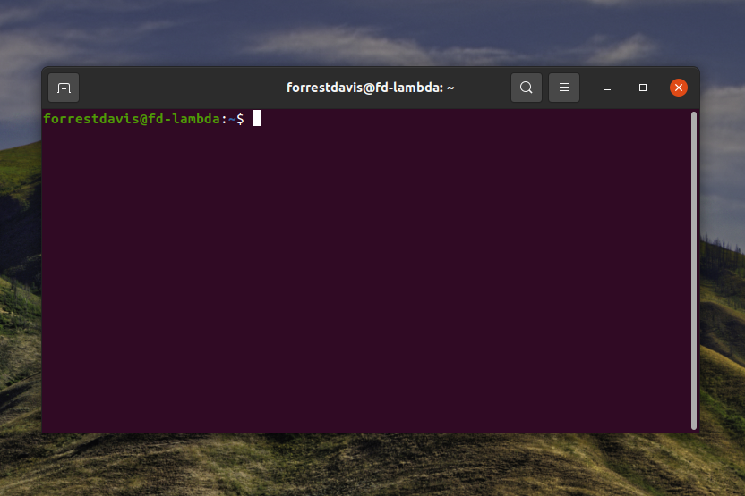
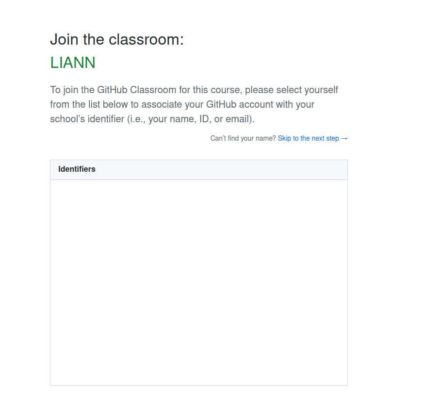
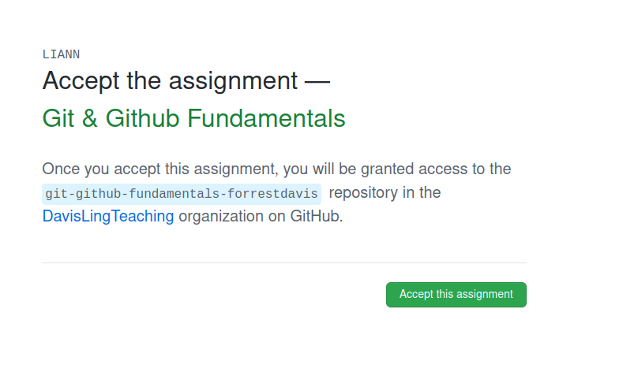
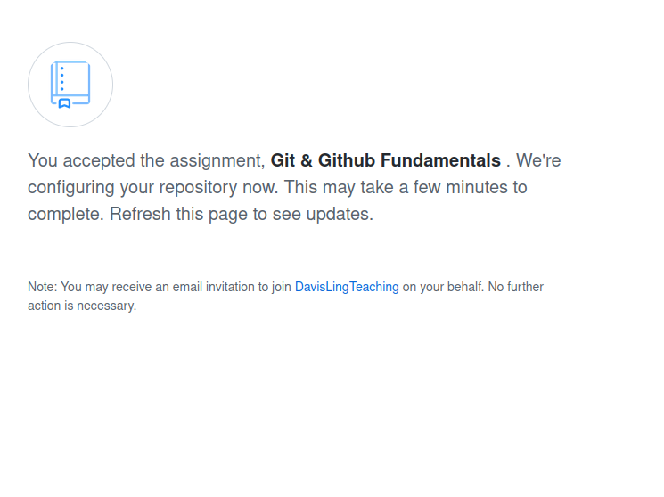
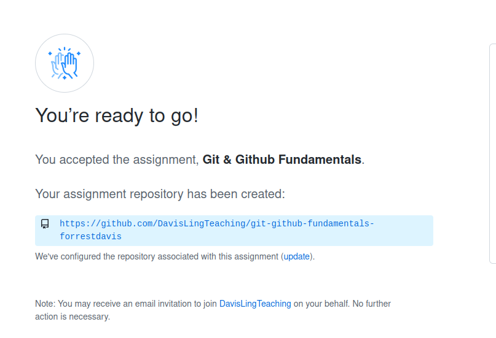
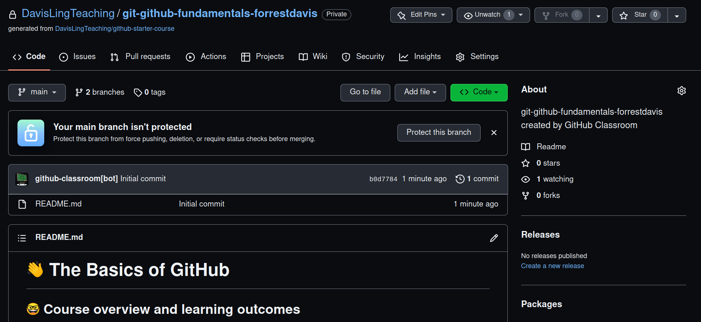
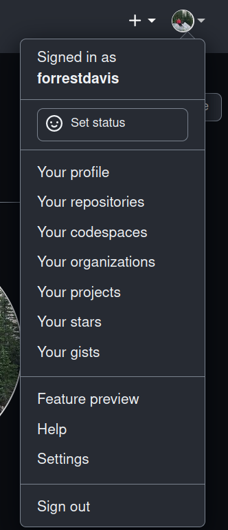
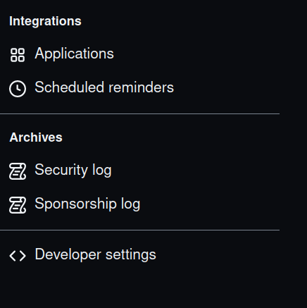

# Setting up your computer for the course

There are four key things to establish. Each 
is handled in its own markdown file. Some of this 
material is repeated in other repositories for the course, but 
I have chosen to compile everything here to serve as a reference 
for you. 

- [ ] Basics of using the command line ([CommandLine.md](CommandLine.md))
- [ ] Install python and creating environment ([Python.md](Python.md))
- [ ] Github and Github Classroom ([Github.md](Github.md))
- [ ] Google Colab ([Colab.md](Colab.md))

Proceeding in the above order is preferable (you'll link your Github to 
GoogleDrive in setting up colab). Where applicable, I will mention 
operating system differences. I've personally tried these installs 
on Ubuntu (Linux) and Windows 10, as well as an old mac. The new Mac's 
have certain challenges (with huggingface/pytorch in particular), 
and I still need to workshop those. If you are having problems, 
please let me know. If you just can't get things to work on 
your machine, or you'd rather not install things, the colab
option should work for everyone (as long as you have reliable 
wifi). 

Below I touch briefly on text editors, which you may find helpful if you 
do the assignments on your computer. 

## Text Editors

For editing programs, I use [vim](https://www.vim.org/). I know people have strong feelings about vim. Other, perhaps more friendly, alternatives include [Atom](https://atom.io/), [Visual Studio Code](https://code.visualstudio.com), [PyCharm](https://www.jetbrains.com/pycharm/), and [Eclipse](https://www.pydev.org/). You could also just use the plain text editor on your computer, as we won't be building huge code bases in the course. If you do try vim, I'd be happy to share with 
you my vimrc which has alright settings. Additionally, I can show you how to add some nice
plugins.

# Some basics in using the command line

If you haven't used the command line before, it can be a bit confusing. The following 
goes over some basic commands for navigating the command line. See [Python.md](Python.md)
for using python on the command line. I focus here on commands that will 
work with Linux or Mac. I confess that I haven't used Windows since I was a kid. I installed
a virtual machine with Windows to test some of the course materials, and it seems 
PowerShell accepts similar commands. Windows 10 allows you to install Linux in the same
environment as your OS, so I'd recommend doing that. For a more thorough introduction 
and overview of using the command line see "[The Missing Semester of Your CS Education](https://missing.csail.mit.edu)".

## Opening the command line

This is straightforward, just search Terminal (if you are on Windows see the note above). 
Starting terminal you should see a window like that in @fig:Terminal.

{#fig:Terminal}

## Navigation 

Now that you have the terminal open, let's figure out where you are. If you run 
pwd you will get the name of the directory (or folder) that you are in. 
Below, and in following code demonstrations, I show you the command and sample
output to give you a sense of what to expect. You should
follow along on your computer.   

```
forrestdavis@fd-lambda:~$ pwd
/home/forrestdavis
```

Typing ls will show you the files in the current directory.

```
forrestdavis@fd-lambda:~$ ls

 Dissertation.pdf       pictureOfMyCat.png     
 test.py                README.md

```

In all likelihood, directories (or folders) will be in one color and files in another. 

Suppose we had the following directory structure:

```
/home/forrestdavis
|   
|   Dissertation.pdf
|   pictureOfMyCat.png
|   README.md
|   test.py
|
|---folder1
|   |   file011.txt
|   |   helloWorld.py
|   |
|   |---subfolder1
|       |   file111.txt
|       |   file112.txt
|       |   ...
|   
|---folder2
    |   file021.txt
    |   file022.txt
```

In order to run helloWorld.py or edit file011.txt from the command line, it is useful 
to navigate to folder1. We can do that by entering cd folder1

```
forrestdavis@fd-lambda:~$ cd folder1
forrestdavis@fd-lambda:~/folder1$ ls

 file011.txt    helloWorld.py

```

We can also navigate backward using cd ..

```
forrestdavis@fd-lambda:~/folder1$ cd ..
forrestdavis@fd-lambda:~$ ls

 Dissertation.pdf       pictureOfMyCat.png     
 README.md              test.py                

```

If I wanted to edit file111.txt, I can move through multiple folders by adding 
to my cd statement (or successively typing cd) like cd folder1/subfolder1

```
forrestdavis@fd-lambda:~$ cd folder1/subfolder1
forrestdavis@fd-lambda:~/folder1/subfolder1$ ls

 file111.txt    file112.txt

```

I can similarly chain backward movements like cd ../..

```
forrestdavis@fd-lambda:~/folder1/subfolder1$ cd ../..
forrestdavis@fd-lambda:~$ ls

 Dissertation.pdf       pictureOfMyCat.png     
 README.md              test.py                
```

I could have, instead, just typed cd which would have returned me to my home directory. 
Finally, in addition to ls, it is also useful to see "hidden" files (especially when 
using Github). You can access these by typing ls -a 

```
forrestdavis@fd-lambda:~$ ls -a

 .                      ..
 .bashrc                Dissertation.pdf       
 pictureOfMyCat.png     README.md
 test.py                .vimrc

```

## Other useful commands
 
There are a number of handy programs that come along with your command line. I'll focus
on a very small fraction here. 

Let's imagine we have a file "hello.txt" which has two lines: "Hello!" and 
"Welcome to the course". We can interact with that file on the command line
in various ways. We can output all the lines of the file using cat
 
```
forrestdavis@fd-lambda:~$ cat hello.txt 
Hello!
Welcome to the course
```

I can add a line to the file using echo and >>

```
forrestdavis@fd-lambda:~$ echo "Noam Chomsky!" >> hello.txt
forrestdavis@fd-lambda:~$ cat hello.txt 
Hello!
Welcome to the course
Noam Chomsky!
```

If we had instead use only one > above, the file would have been overwritten and 
just the line "Noam Chomsky!" would remain. We can even chain together commands 
using "pipes", represented by |. I might have a large file which I want to see 
only the top part of. I can do this by chaining cat with another command 
called head using a pipe. It won't show a difference in our running example because 
the file is so small. 

```
forrestdavis@fd-lambda:~$ cat hello.txt | head
---
figPrefix: Figure
---
Hello!
Welcome to the course
Noam Chomsky!
```

The command tail does a similar thing with the bottom part of a file. You can 
also just run head or tail followed by the filename. With additional 
commands we can create useful programs. For example, we might count how many 
words there are in a file. 

```
forrestdavis@fd-lambda:~$ cat hello.txt | wc -w
7
```

We might add another "Noam Chomsky!" line and get the number of times each line occurs:

```
forrestdavis@fd-lambda:~$ echo "Noam Chomsky!" >> hello.txt | cat hello.txt | uniq -c
      1 Hello!
      1 Welcome to the course
      2 Noam Chomsky!
```

Finally, we can use the command grep to search for strings (using regular expressions, 
if you know how). 

```
forrestdavis@fd-lambda:~$ cat hello.txt | grep "the"
Welcome to the course
```

Notice that grep returns the line(s) with the search term. We can have it return 
lines without the search term by using the flag -v

```
forrestdavis@fd-lambda:~$ cat hello.txt | grep -v "the"
Hello!
Noam Chomsky!
Noam Chomsky!
```

# Installing Python and using Conda Environments

## Anaconda

Navigate to [Anaconda](https://www.anaconda.com/products/distribution) and install the 
relevant version for your OS (use python 3.9, which should be the default). 
Once the file has downloaded, run the file and 
follow the install prompts. To work with Anaconda on Windows use the "Anaconda Powershell Prompt". For Mac (following the defaults during installation), 
I believe you need to enter the following commands from the Terminal once the initial 
installation has completed:

```
source /opt/anaconda3/bin/activate
conda init zsh
```

In restarting Terminal, you should now see 

```
(base) name@Mac ~ %
```

For Linux, I think it is straightforward. 

## Setting up environment

It is critical that we all use the same version of packages. The autograder will expect 
these specific versions as well. To facilitate this, I have shared with you a 
yml file which you should use to create a python environment in conda. 

Ensure that you see in your terminal (base):

```
(base) ...
```

Navigate to where you have downloaded the yml file and run:

```
conda env create -n LIANN --file LIANN.yml
```

This will create a new environment. To activate it, run:

```
conda activate LIANN
```

N.B. This may not work with new Mac's because of their new chips. I am looking into 
how to do this, so let me know if you run into an issue.

When working on assignments make sure you see (LIANN) instead of (base). We may need 
to add additional packages as the course unfolds. I will provide instructions on how to do 
this when needed. 

## Interacting with python via the command line

Now that you have python installed, you can interact with python via the command line.
There are two main ways of doing this: 1) via python's interpreter and
2) via running python scripts. 

To initiate python's interpreter just run the command python: 

```
(LIANN) forrestdavis:~$ python
iPython 3.9.4 (default, Apr  9 2021, 16:34:09) 
[GCC 7.3.0] :: Anaconda, Inc. on linux
Type "help", "copyright", "credits" or "license" for more information.
>>> 
```

Within the interpreter you can interact with python dynamically, which is useful for 
typing out small things. For any larger project, however, you should write a 
separate script (we return to this momentarily). Within the interpreter, we might 
create variables and manipulate them: 

```
>>> x = 1
>>> x += 1
>>> x
2
>>> theBest = 'Noam Chomsky'
>>> theBest.split(' ')
['Noam', 'Chomsky']
>>> 8*8981
71848
```

Notice that variables persist within the body of the interpreter. There are still scopes,
for example I can make a function with takes a string and adds '!' to the end. The
variables referenced within this function are not accessible to operations outside the 
function.

```
>>> def addAH(aString):
...     newString = aString + "!"
...     return newString
... 
>>> addAH(theBest)
'Noam Chomsky!'
>>> newString
Traceback (most recent call last):
  File "<stdin>", line 1, in <module>
NameError: name 'newString' is not defined
```

Finally, we can run python scripts by python SCRIPTNAME.py. For example, I might 
have a script which has addAH from above in a file called excite.py. That is, 
opening excite.py, I should see: 

```
(LIANN) forrestdavis:~$ cat excite.py
def addAH(aString):

    newString = aString + '!'
    return newString

print(addAH('Noam Chomsky'))
(LIANN) forrestdavis:~$ python excite.py
Noam Chomsky! 
```
# Creating a Github account and using Github

## Creating an account

You should create a github account by navigating [here](https://github.com/). Use your MIT (or 
other university email) in signing up so that you can access the student [benefits](https://education.github.com/benefits). 

You can either download the Desktop version of github [here](https://desktop.github.com/) or
use the command line interface [here](https://git-scm.com/) (this is what I do, so I'm more familiar with this). 

If you are using the Desktop version, I believe you can skip to the bottom of this section (i.e.
to "Once you have github...").

For Windows, if you are using the command line interface, install it with Git Bash. 
Additionally, take care with the default text editor for git. It's default is vim. 

If you aren't familiar with vim, I recommend using Notepad for Windows, Text Editor in Ubuntu/Linux (which 
you can access via the terminal with the command gedit), and TextEdit for Mac OS.
Also note, when asked whether to let git decide or
to override the default repository name, use override and set to main. After that use the defaults for the prompts. Once you have installed it, enter the following commands: 

```
  git config --global user.name "NAME"
  git config --global user.emal "email@etc.com"
```

With NAME set to your github username and similarly for email.

An additional useful step is to add a new public key to your github, so that you can use github without having to sign in each time you try downloading code. To do that, first create a new 
ssh key, if you don't already have one, ([instructions](https://docs.github.com/en/authentication/connecting-to-github-with-ssh/generating-a-new-ssh-key-and-adding-it-to-the-ssh-agent)). [N.B. use your github email in creating the ssh key].  
Once you have done this, see this [guide](https://docs.github.com/en/authentication/connecting-to-github-with-ssh/adding-a-new-ssh-key-to-your-github-account). 

## Using Github

The main object of Github is a repository or a repo. A repo is a collection of code
which is stored on Github and can be downloaded easily be everyone. Within 
software development Github is a key resource for developing and maintaining 
open source projects. Within research, it's where most everyone stores the code 
associated with their paper. For this course we will use repos for assignments. 
In fact, we will use Github Classroom, which allows you to use Github's interface 
to submit assignments for automatic grading and in a way that I can easily provide
feedback.

First, let's begin with interacting with a given repository, before we talk about 
submitting and getting feedback on assignments. Assuming you have set up a 
github account successfully, navigate to the following [link](https://classroom.github.com/a/aFMlQpuS), 
which will add you to the course Github Classroom and provide a beginner guide to using github. You should see the following sequence of things in following the link: 

1. You'll land here (see @fig:FirstScreen) after clicking the link. Click "Skip to the next step $\rightarrow$"
       
{#fig:FirstScreen}

2. Next you'll be asked to accept the assignment (see @fig:SecondScreen). Do so.

{#fig:SecondScreen}

3. Once you accept you should see another window (see @fig:ThirdScreen). 
Wait a moment and then refresh the page. 

{#fig:ThirdScreen}

4. Upon refreshing you should see the following (see @fig:FourthScreen). 
Click the link in the blue box. 

{#fig:FourthScreen}

5. Finally, you should land on your repo (see @fig:FifthScreen). 
Note that this is a private repo. Only 
you and I can see it. 

{#fig:FifthScreen}


If you are using command line, 
clone the code using ssh (navigate to the green "<> Code" button and use 
the ssh option). Then navigate to your desired 
location (via Git Bash on Windows or Terminal on Mac/Linux) and enter: 

```
git clone LINK
```

where LINK is from copying the ssh option in the online copy of the repository (on Github). 
This will copy the repo and it's contents to 
your computer. 

If, instead, you are using Github Desktop, you can clone the repo directly by selecting clone repository and selecting the name from the drop down menu.

You should now be all set to use github for the course. We will try out more of the workflow 
with another assignment. 

The typical workflow for using github involves the following steps (exemplified 
with the just created repo above)

1. Checking the status of your repo (i.e. what files have been changed) which is 
done via:

```
(LIANN) forrestdavis:~$ git status
On branch main
Your branch is up to date with 'origin/main'.

nothing to commit, working tree clean

```

2. If there are updates, download these updates using git pull: 

```
(LIANN) forrestdavis:~$ git pull
Already up to date.
```

3. Update your files to complete the assignment (not required for this particular 
example repo, but I demonstrate changes anyway). You can see your changes using git status.  

```
(LIANN) forrestdavis:~$ git status
On branch main
Your branch is up to date with 'origin/main'.

Changes not staged for commit:
  (use "git add <file>..." to update what will be committed)
  (use "git restore <file>..." to discard changes in working directory)
	modified:   README.md

no changes added to commit (use "git add" and/or "git commit -a")
```

4. Add your changed files via git add. You can either do this by file via git add FILENAMe or you can add all "tracked files" (i.e. the ones associated with the repo online) via 
git add -u: 

```
(LIANN) forrestdavis:~$ git add README.md
(LIANN) forrestdavis:~$ git status
`On branch main
Your branch is up to date with 'origin/main'.

Changes to be committed:
  (use "git restore --staged <file>..." to unstage)
	modified:   README.md
```

5. Add a description of what changes you made via git commit -m MESSAGE: 

```
(LIANN) forrestdavis:~$ git commit -m "Removed second line of README.md"
(LIANN) forrestdavis:~$ git status
On branch main
Your branch is ahead of 'origin/main' by 1 commit.
  (use "git push" to publish your local commits)

nothing to commit, working tree clean
```

6. Notice that our status now says that our branch is ahead of the origin/main one. This
means the version on your computer has been changed from the version of the repo on
Github. You can update this version by "pushing" your changes. This is done via 
git push: 

```
(LIANN) forrestdavis:~$ git push
Enumerating objects: 5, done.
Counting objects: 100% (5/5), done.
Delta compression using up to 4 threads
Compressing objects: 100% (2/2), done.
Writing objects: 100% (3/3), 291 bytes | 291.00 KiB/s, done.
Total 3 (delta 1), reused 0 (delta 0)
remote: Resolving deltas: 100% (1/1), completed with 1 local object.
To github.com:DavisLingTeaching/git-github-fundamentals-forrestdavis.git
   b0d7784..f18a28d  main -> main
(LIANN) forrestdavis:~$ git staus
On branch main
Your branch is up to date with 'origin/main'.

nothing to commit, working tree clean
```

As you do this many times, you'll accumulate changes on your online repo. You can 
see a log of all your commit messages using "git log": 

```
(LIANN) forrestdavis:~$ git log
Author: forrestdavis <fd252@cornell.edu>
Date:   Sat Aug 27 12:29:40 2022 -0400

    Removed second line of README.md

commit b0d77842f9c1de506e5d34b63a81f184525e3eac
Author: github-classroom[bot] <66690702+github-classroom[bot]@users.noreply.github.com>
Date:   Sat Aug 27 16:09:22 2022 +0000

    Initial commit
```

Issues may arise, especially around branch conflicts, which require other commands 
like merge. If you run into issues, please post in the Discussion portion of the 
canvas page, and I, or anyone else in the class who happens to know github, can 
provide guidance. 

## Submitting assignments and getting feedback

The above discussion hopefully showed you the basics of using github. What's left is
how to get grades and feedback from me on assignments. You may begin with the 
BasicPython assignment, which you can activate via this [link](https://classroom.github.com/a/gv24Yj56). The following recapitulates portions of the README of that assignment. 
It is repeated here to serve as a general reference point. 

In this course, we will try to use Github Classroom. Not only will this interface introduce you to using Github, where you will find 99\% of code used in academic papers, but it also allows you to submit your assignments and have them automatically checked. This way, you can make progress on the assignment at your own pace, submitting as often as you'd like. Moreover, if you are stuck on a part of your code and would like me to take a look and try to help you (which I strongly encourage you to do!), you can do so directly through Github. Using their interface, I can comment on specific lines of your code, suggest changes, and we can have a discussion about what you are working on. This is my first time using Github in this capacity for a course, so I'm sure we will have to iron out any issues as we go together, but my hope is that it provides you direct and helpful feedback. 

In having accepted the BasicPython assignment (link above), 
a "pull request" will have been made. If you navigate there, 
you will see the initial autograding results. Clone the repo to your device and make changes 
to solve the exercises below. 

For example, we might change the code in helloworld.py to: 
```
def helloWorld() -> str:
    """
    Returns a string
    Correct behavior: return the string "Hello World!"
    """

    return "hello"

```

Git will register that we have changed the file. To check this navigate to the directory 
and type 

```
git status
```

If you are using the command line, you should see something like: 


```
On branch main
Your branch is up to date with 'origin/main'.

Changes not staged for commit:
  (use "git add <file>..." to update what will be committed)
  (use "git restore <file>..." to discard changes in working directory)
        modified:   helloworld.py

no changes added to commit (use "git add" and/or "git commit -a")
```

Next we want to add our changes to our repo. We do this by, 

```
git add helloword.py
```

Then we add a message, which describes what we've done. For example, 

```
git commit -m "Trying out returning a string"
```

Now, we can "push" these changes to our repo by

```
git push 
```

Once it is done, you'll notice your repo online has changed and grading should commence again.

If you are using github desktop, the change will be automatically registered. You can add a
message via their API and push the changes. 

In time you should receive an email which records the results of the auotgrading. In 
this case it will say "All jobs have failed". If you "view workflow run" you can see 
the specific errors. See [Github.md](../Github.md) for a short video showing you how to navigate to the autograder 
results from your repo on Github.

If you'd like to ask a specific question about your code to me, you can do so via 
the "feedback" branch which is automatically created. See the video on [Github.md](../Github.md)
, which walks through 
adding a comment to a specific line of your code. Once you submit a review, I get a notification,
and can supply additional comments or even suggest code.

If you have any addition questions, feel free to post them on the Dicussion page 
of the course canvas. You can also email me at forrestd@mit.edu. I hope this was 
helpful. 

# Using colab and how to interact with Github

In case you'd rather do the assignments entirely online (maybe you like being 
online all the time, maybe you couldn't get the packages to download on your computer, 
maybe your laptop isn't working), the following guide will 
walk you through how to do this via colab. Colab is a service provided by 
Google which gives you access to python with free compute resources (like a GPU!). Colab 
can interact with your GoogleDrive, allowing you to save and to load your own files. You 
can even clone repositories from Github. We will use these two facts to work on 
and submit assignments all via the cloud. 

## Prerequisites 

- [ ] Google account with access to GoogleDrive
- [ ] Github account (see [Github.md](Github.md)) 
- [ ] Wifi

## Adding Colab to your GoogleDrive

If you haven't used colab on your GoogleDrive before you'll need to add it 
to the apps. To do this, within GoogleDrive, right click. You'll see a bunch 
of options for new things you can create. Click "More". If you don't see 
Google Colaboratory click '+ Connect more apps'. Search colaboratory and install
the app. You will now be able to create and use colab notebooks. 

## Basic of Colab

Google has a guide for using Colab which you may find useful ([link](https://colab.research.google.com/?utm_source=scs-index)). Essentially, Colab is a way of writing and 
executing Python code directly in your browser. A Colab notebook consists of 
two blocks. 

The first is a text block, where you can annotate your code. It 
use Markdown, which is what this itself is written in. Markdown is a basic markup 
language which let's you write formatted files using plain text files. It's pretty
simple (especially compared to LaTeX). You don't have to dig into it, if you don't 
want to. The text blocks on Colab include shortcuts to most things you might 
be interested in.  

The second type of block is a code block. It is within these that you write 
python code, and you can even execute it. The entire notebook defines 
a workspace, so a function written in one code block can be accessed 
in another code block. (N.B. You may find it useful to update the number 
of spaces for indentation to 4. You can do this via the settings, which 
are accessible within any colab script. Navigate to "Editor" and use 
the dropdown menu under "Indentation width in spaces".)

## Allowing Colab to Access Colab scripts on Github

We are using private github repos for this course. You will need to allow 
colab access to such repos. To do this: 

1. Click this [link](https://colab.research.google.com/github/). 
2. Click the checkbox "Include Private Repos"
3. Sign-in to your Github account and authorize Colab via the popup window
4. The link in Step 1 should allow you to browse your repos. Click a repo 
   to access it.

Access a repo via step 4 will allow you to access a copy of your repo. However, 
as far as I can tell, this will only give you access to any existing colab 
scripts on the repo. We can go one step further than this. 

## Generating a GitHub access token

To download and edit all the files in your github repository, we need to interact 
directly with github. First, we need to create a personal access token. To do this, 
got to your github. Navigate to the Settings (see @fig:GitSettings). Then navigate
to "Developer Settings" (see @fig:DevSettings)

{#fig:GitSettings}

{#fig:DevSettings}

Once there, navigate to "Personal access tokens". Then click "Generate new token". 
Write the token down somewhere (it will be long and basically a string of random 
stuff). You won't be able to see it once you set it up, so don't lose what you wrote
down (you could always create a new token if you mess this up). Also crucially, 
DO NOT SHARE THIS TOKEN. Don't add it to a file that you push onto github, for example.

## Cloining repo to GoogleDrive

With our token in hand, we can now clone our private repos to github. I've included 
a template colab script to do this ([CloningGitRepo.ipynb](CloningGitRepo.ipynb)). 
Once again, if you edit this to add your 
token, please do not push the changes to github. Below, I go over the components 
of this script. 

To clone the repo, first we "mount" GoogleDrive to our colab instance. That is, 
we make sure we can access our GoogleDrive via colab by typing the following in 
a code block. 

```
from google.colab import drive
drive.mount("/content/drive")
```

This will prompt you to allow colab to access your GoogleDrive. Do so. Next, 
we need to set some variables: 


```
#Should be the same for you
PATH = "/content/drive/MyDrive"

#Additional path to where you want to save your repos
REPOPARENT = "/PATH/TO/PARENT/"

#Name of repo
REPONAME = "BasicPython"

#Github account name 
GITNAME = 'YOUR GITHUB NAME'

#Git Personal Access Token DO NOT SHARE THIS!
GITTOKEN = "YOUR ACCESS TOKEN"
```
 
Now, we can navigate to where we want to save our repo (PATH+REPOPARENT) 
and clone the repo:

```
#Navigate to place to save repo
%cd "{PATH}{REPOPARENT}"

#Clone repo
!git clone "https://{GITTOKEN}@github.com/{GITNAME}/{REPONAME}.git"
```

We can check that this worked by first navigating to the repo:

```
%cd {REPONAME}
```

Then, we check that we have a clone:

```
!git status
```

And that's that! You can now edit files directly in colab by navigating 
to them using the interface on the far left and opening the file by double-clicking. 
For each assignment, I include a colab script for interacting with the files 
(assuming you have cloned the repo using the above steps). This will also 
include how to add changes. It is rather straightforward. You use the same 
commands we discussed in [Github.md](Github.md), but we prepend !.

If you've followed along with the prior guides, you should be familiar with 
the command line interface, you 
should have python on your computer, 
you should be able to run the python 
interpreter/scripts, you should 
have a github account, you should 
be familiar with submitting 
assignments via Github Classroom, 
and, finally, you should have the 
ability to use colab for your
assignments :)
